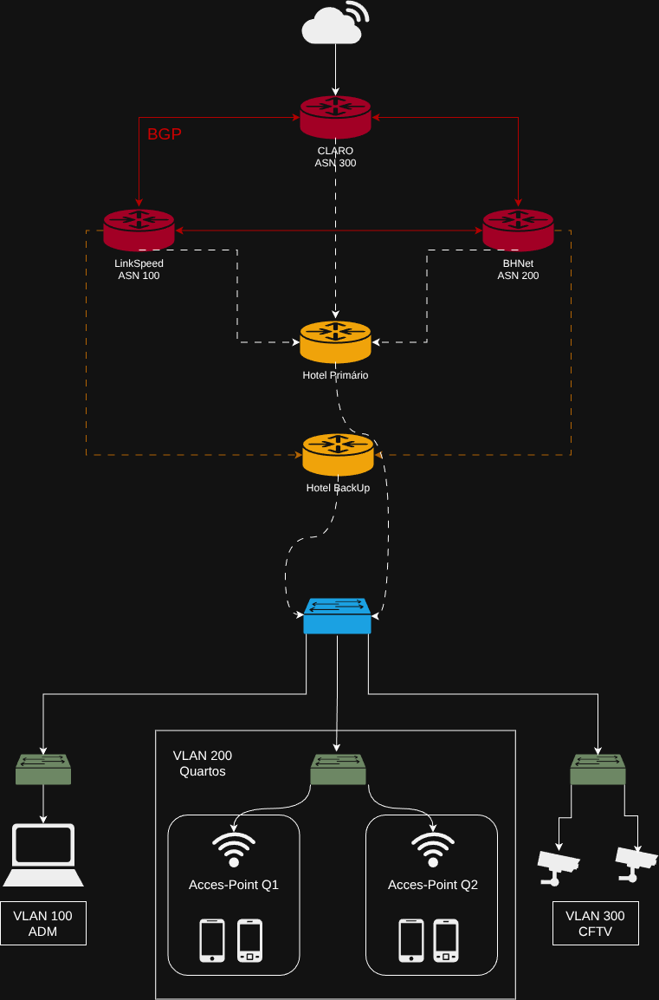
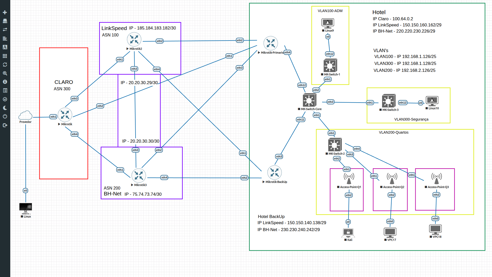

# SIXCORE – Estudo técnico patrocinado pela Controllar Sistemas de Segurança e Acesso LTDA.

Nota:
Para fins de documentação, foi utilizada a ferramenta ChatGPT como apoio na descrição e organização dos scripts (backups). Todas as configurações, validações e implementações foram realizadas por mim acompanhando as aulas do professor Leonardo Vieira de Albuquerque (https://www.linkedin.com/in/albuquerqueleonardo/) na plataforma SixCore (https://sixcore.com.br/).

________________________________________________________________________________________

# 🏨 Projeto de Rede Corporativa – Hotel Multi-Operadora (MikroTik / EVE-NG)

## 📌 Visão Geral

Este projeto simula a infraestrutura completa de um hotel corporativo com:

* Multi-homing com BGP
* Segmentação por VLAN
* Redundância de links
* VPN site-to-site
* Hotspot para clientes
* Separação de redes (ADM / Clientes / Segurança)

Ambiente desenvolvido em laboratório utilizando **EVE-NG + MikroTik RouterOS v7**.

## 🖼️ Diagrama da Topologia

---

## 🧠 Arquitetura

### 🌐 Camada ISP

* **R1 – Claro (Core ISP)**
* **R2 – LinkSpeed**
* **R3 – BHNet**

✔️ BGP multi-homing
✔️ Anúncio e filtragem de rotas
✔️ IPv4

---

### 🏨 Borda do Cliente (Hotel)

#### 🔹 R4 – Hotel Primário

* Recebe links dos 3 provedores
* Balanceamento/failover via rotas
* VLANs internas (100/200/300)
* VPN (WireGuard / SSTP)

#### 🔹 R5 – Hotel Backup

* Link redundante
* Failover automático

---

### 🧠 Core de Rede

#### 🔹 R6 – Switch Core

* VLANs:

  * 100 → Administração
  * 200 → Clientes
  * 300 → Segurança
* Distribuição para switches de acesso

---

### 🔌 Camada de Acesso

#### 🔹 R7 – Switch Quartos

* VLAN 200 (Clientes)
* Portas access para quartos
* Uplink trunk para core

#### 🔹 R8 – Switch Segurança

* VLAN 300 (CFTV)
* Câmeras isoladas
* Sem acesso direto à internet

#### 🔹 R9 – Switch Administração

* VLAN 100
* PCs administrativos
* Rede interna protegida

---

### 📶 Camada de Usuário (Edge)

#### 🔹 R10 – AccessPoints por Quarto

* VLAN 200
* Hotspot (captive portal)
* NAT local
* Controle de acesso por usuário

---

## 🌐 Redes WAN / Links entre Provedores

| Link                        | Subrede              | Equipamentos                     |
|-----------------------------|----------------------|----------------------------------|
| Claro ↔ LinkSpeed           | 185.184.183.180/30   | Claro / LinkSpeed                |
| Claro ↔ BHNet               | 75.74.73.72/30       | Claro / BHNet                    |
| LinkSpeed ↔ BHNet           | 20.20.30.28/30       | LinkSpeed / BHNet                |
| LinkSpeed ↔ Hotel Primário  | 150.150.160.160/29   | LinkSpeed / Hotel Primário       |
| LinkSpeed ↔ Hotel Backup    | 150.150.140.136/29   | LinkSpeed / Hotel Backup         |
| BHNet ↔ Hotel Primário      | 220.220.230.224/29   | BHNet / Hotel Primário           |
| BHNet ↔ Hotel Backup        | 230.230.240.240/29   | BHNet / Hotel Backup             |

---

## 🌍 Redes Anunciadas via BGP

### 🔵 Claro (AS 300)

| Prefixo              | Tipo         |
|----------------------|-------------|
| 200.100.10.0/24      | Anunciado   |
| 200.100.20.0/24      | Anunciado   |
| 200.100.30.0/24      | Anunciado   |
| 200.100.40.0/24      | Anunciado   |
| 70.70.68.0/22        | Anunciado   |
| 70.70.70.0/23        | Anunciado   |
| 70.70.70.0/24        | Anunciado   |

---

### 🟢 LinkSpeed (AS 100)

| Prefixo        | Tipo       |
|----------------|-----------|
| 200.2.0.0/22   | Próprio   |
| 200.2.0.0/23   | Próprio   |
| 200.2.0.0/24   | Próprio   |

---

### 🟣 BHNet (AS 200)

| Prefixo        | Tipo       |
|----------------|-----------|
| 5.4.3.0/24     | Próprio   |
| 9.8.7.0/24     | Próprio   |

---

## 🔒 Redes Internas e Serviços

| Uso              | Subrede             | Observação |
|------------------|---------------------|------------|
| CGNAT Hotel      | 100.64.0.0/30       | PPPoE      |
| WireGuard        | 10.0.0.0/30         | VPN BHNet ↔ Hotel |
| Hotspot          | 10.5.50.0/24        | Quartos    |
| Pool VPN         | 10.250.250.0/29     | Acesso remoto |

---

## 🔐 VLANs internas do Hotel

| VLAN | Uso                  | Subrede            |
|------|----------------------|--------------------|
| 100  | Administração        | 192.168.1.0/25     |
| 200  | Clientes (Quartos)   | 192.168.2.0/25     |
| 300  | Segurança            | 192.168.1.128/25   |

---

✔️ Isolamento entre redes
✔️ Controle de tráfego
✔️ Segurança por design

---

## 🔁 Redundância

* Multi-WAN (3 ISPs)
* Rotas com distância
* Backup via segundo roteador
* VPN entre sites

---

## 🌍 BGP

* Sessões eBGP entre ISPs
* Filtros de import/export
* Anúncio de prefixos próprios
* Uso de tabelas separadas (VRF-like)

---

## 🔐 Segurança

* Firewall com:

  * Drop de inválidos
  * Proteção contra port scan
* VLAN isolando:

  * Clientes
  * Administração
  * CFTV
* CFTV sem acesso direto à internet
* VPN segura entre pontos

---

## 📡 Hotspot

* Rede dedicada: `10.5.50.0/24`
* Autenticação de usuários
* NAT controlado
* Possibilidade de captive portal

---

## 📊 Boas Práticas Aplicadas

✔️ Separação por camadas (Core / Access / Edge)
✔️ Padronização de nomes
✔️ VLAN tagging correto (trunk vs access)
✔️ Redução de configs duplicadas
✔️ Organização para troubleshooting

---

## 🚀 Objetivo do Projeto

Demonstrar conhecimento em:

* Redes corporativas
* Infraestrutura ISP
* MikroTik avançado
* BGP na prática
* Segmentação e segurança

---

## 🧠 Conclusão

Este laboratório representa um ambiente de produção, integrando:

* Provedor (ISP)
* Cliente corporativo
* Acesso de usuários
* Segurança e segmentação

Primeiro projeto finalizado!

---
